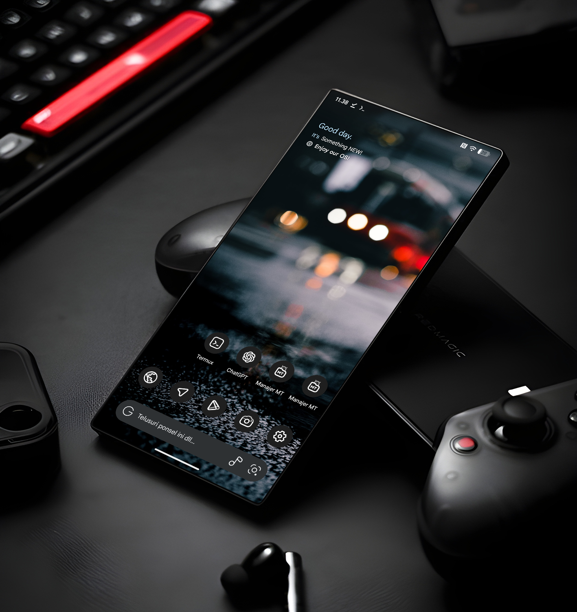

import Highlight from '@site/src/components/Highlight';

# Perkenalan

:::tip Welcome
Selamat datang di Meng Pedia
:::
Hai, saya Juni.

Website ini dibuat sebagai tempat menyimpan catatan, cerita, dan pengalaman pribadi aku dalam mengoprek HP, khususnya di dunia Android.

Semua yang ada di sini berawal dari rasa penasaran: mencoba custom ROM, flashing, root, memperbaiki error, sampai mencari solusi dari berbagai masalah sistem. Dari proses trial & error itulah, banyak pelajaran yang akhirnya layak untuk dicatat dan dibagikan.  

Melalui website ini, aku ingin mendokumentasikan setiap perjalanan teknis yang pernah aku lalui. Selain sebagai arsip pribadi, semoga juga bisa membantu teman-teman yang sedang belajar atau mengalami masalah serupa.  

Terima kasih sudah berkunjung. Semoga apa yang aku tulis di sini bisa bermanfaat.  

## Evercoss
 hp `pertama` di tahun 2011 yang lupa versi berapa. Bukan java dan tidak bisa install game. Tidak bertahan lama, dijual karna emang menurutku tidak sesuai keinginan. Tapi jadi pengalaman yang berharga untuk tau apa yang ingin dimiliki.

## Nokia 5130 Xpressmusic
menurutku ini best experience memiliki ponsel. Tahun 2011-2016, ini adalah waktu dimana saya mengenal modifikasi game, belajar situs wap, dan blogger.

### Bukan Jago Tapi sekedar tahu

- dari tahun 2012 saya belajar modif game Pes Java.
- mengenal komunitas dan belajar banyak informasi.
- mencoba ekplorasi berbagai hal baru yg belum tau.

## Android Pertama

ditahun 2016, Kelas 1 SMK ketika mulai kenal lingkungan yang lebih besar, banyak orang yg sudah memegang hp android, dan aku menjadi salah satu orang yg ingin memiliki nya.

## Advan S5E Pro (Kitkat)

Ini adalah android pertamaku, dari sini mulai tau root, modifikasi system android. pada saat itu komunitasnya aktif di Facebook, banyak juga yg melakukan port custom rom dan saya banyak mencoba dan belajar port juga. 

## Redmi Note 4x (Mido)

Kesiram kuah cuanki

## Redmi Note 7 Pro (Lavender)

Jatuh dari motor, dijual.

## Poco X3 Pro (Vayu)

Matot

## Redmi Note 12 Turbo (Marble) `sampai sekarang `

Sejujurnya beli ini karna isue Poco X3 pro banyak kasus tiba tiba matot, dan benar saja selama 1 bulan aku meminang hp ini, Vayuku benar benar matot.

Komunitas terbaik yang saya rasa, dengan banyak dev yang aktif membangun, mengembangkan dan meramaikan Custom Rom Marble.
<!--

  
Semoga kamu dapat pengalaman dari ceritaku!

Dokumentasi: <Highlight color="#25c2a0" href="/marble/intro">Tutorial Marble</Highlight>
:::warning Telegram
- [MARBLE 🇮🇩](https://t.me/mengpoi)
- [Poco F5ㅣMarble 🇮🇩](https://t.me/PocoF5indo)
:::

-->
## Rakuten Mini (c330)

Hp yang punya layar imut 
<!--

:::warning Telegram
- [Rakuten Mini](https://t.me/mwwpoi)
:::

-->
## Realme GT 7 Pro (RMX5010)

entahlah
