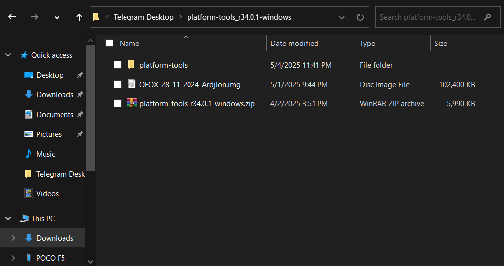
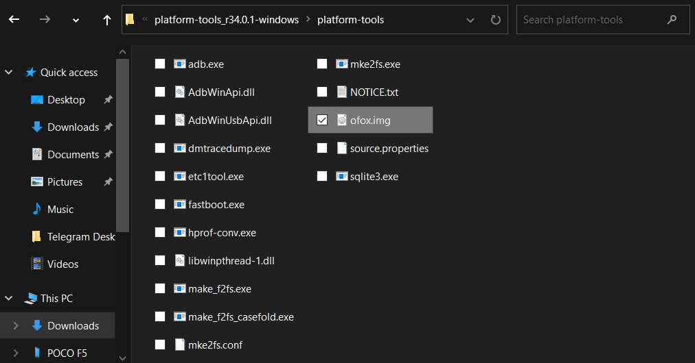
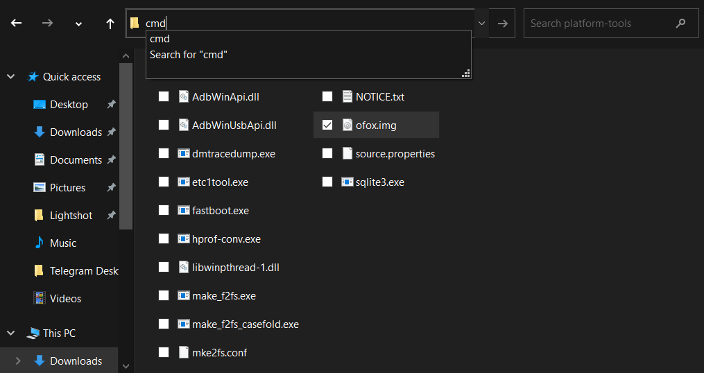
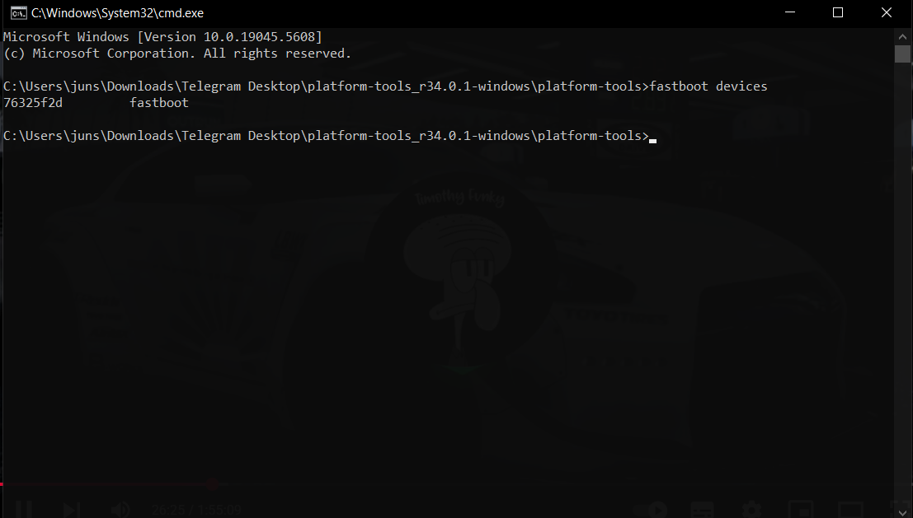
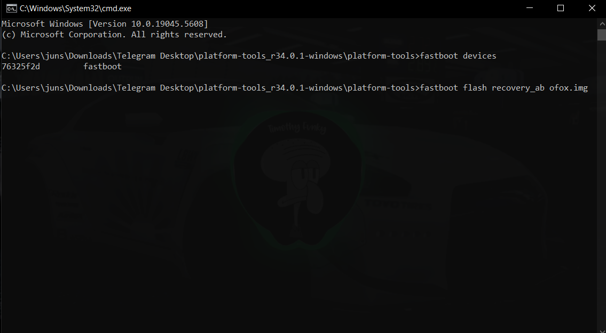

import Highlight from '@site/src/components/Highlight';

# Flash Recovery - PC

Ini cara yang sangat umum digunakan, hanya saja pembeda Poco F5 dengan perangkat lama lainnya adalah adanya partisi A dan B , yang membuat command ketika Flash Recovery sedikit berbeda. Oleh karena itu perhatikan baik baik Command yang nanti akan digunakan.

## Unduh Tool:
<Highlight color="#25c2a0" href="https://developer.android.com/tools/releases/platform-tools?hl=id">Platform Tool SDK</Highlight>
    
### Extrak Platform Tool SDK


copy file recovery yang sudah di download, ke dalam folder `Platform-Tool` tadi.  disini saya akan rename file recovery nya yg panjang itu menjadi  `ofox.img`  agar lebih mudah saat penulisan nanti. 


Kemudian klik bagian yang saya tandai kemudian ketikan 
```
cmd
````
lalu enter.



Setelah dibawa ke tampilan ini, ketikan 
```
fastboot devices
```
pastikan ponsel terdeteksi seperti pada gambar.



Kemudian ketik lagi 
```
fastboot flash recovery_ab ofox.img
```
lalu enter.
 


Selanjutnya ketikan
```
fastboot reboot recovery
```
lalu enter. atau bisa langsung tekan tombol power + volume atas . nanti ponsel akan masuk ke dalam recovery yang tadi diinstall.

Catatan, pada bagian saat flash pastikan Reflash after Installing ROM tercentang, agar recovery tidak hilang ketika flash custom rom baru.


Good Luck
