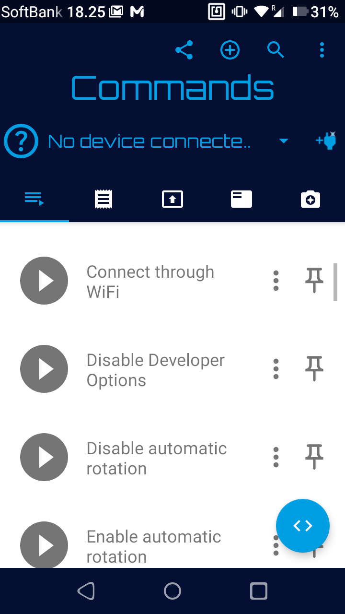
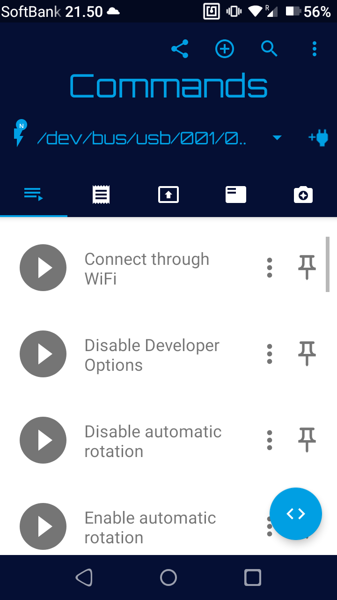
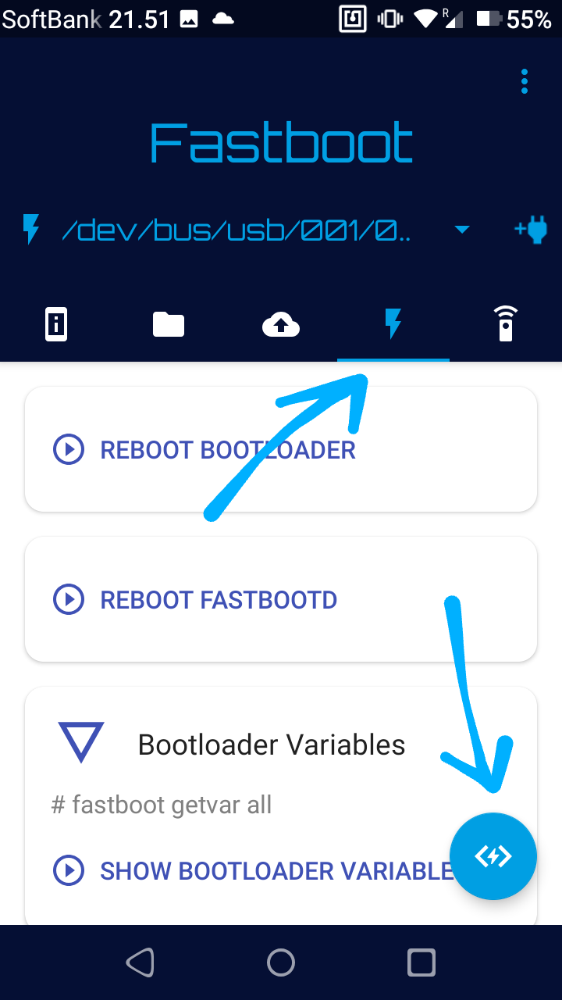
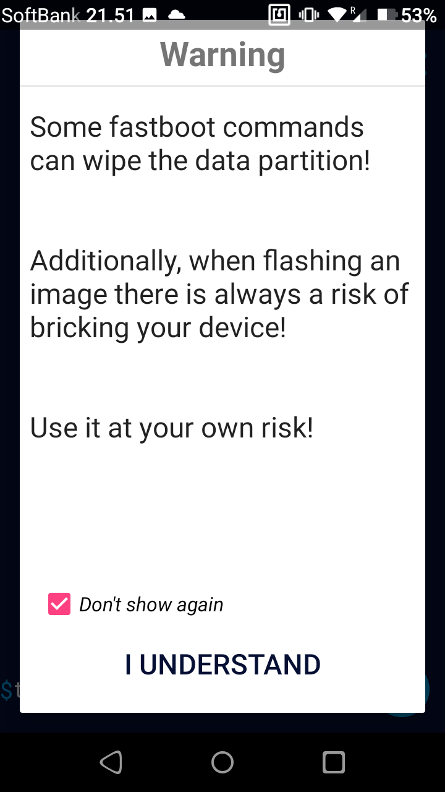
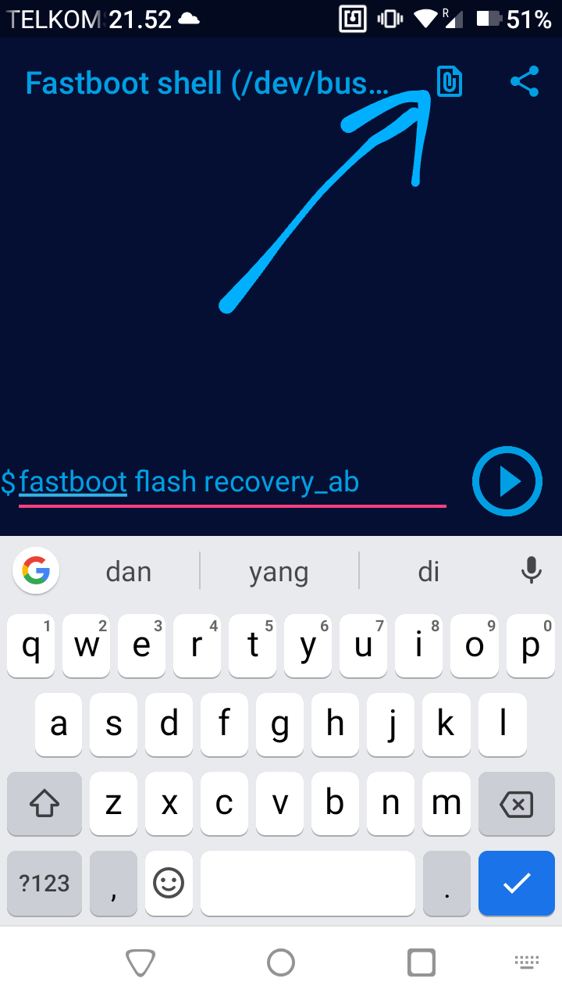
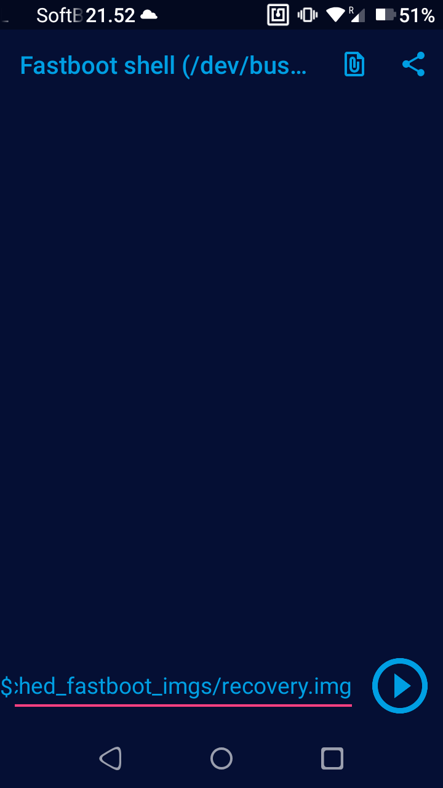
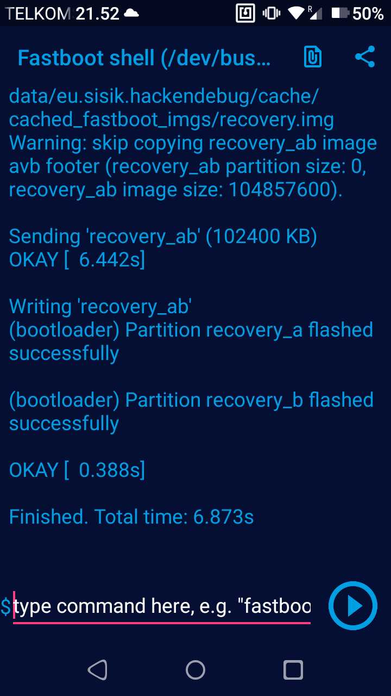

import Highlight from '@site/src/components/Highlight';

# Flash Recovery - Bugjaeger

Flash recovery Tanpa PC menggunakan aplikasi Bugjaeger sendiri dapat digunakan untuk berbagai merk dan type Android. Pastinya dengan catatan telah melakukan UBL ( unlock bootloader ) pada device yang akan dipasang Recovery.

Disini saya akan menggunakan device POCO F5 (marble) yang akan saya pasang Recovery, dan Rakuten Mini sebagai media instalasi nya. Intinya menggunakan device yang support otg, gunakan otg+kabel usb atau c to c jika ada.
 
Yang menjadi pembeda POCO F5 dengan perangkat lain adalah adanya 2 slot pada partisi yang digunakan pada device ini, yaitu A dan B . maka dari itu perhatikan command ketika flash Recovery di POCO F5 .

## Unduh Aplikasi: 

<Highlight color="#25c2a0" href="https://play.google.com/store/apps/details?id=eu.sisik.hackendebug">Bugjaeger</Highlight>

## Step Flash:
1️⃣ Instal dan buka Bugjaeger pada Rakuten Mini


2️⃣ Masuk Mode Fastboot pada Poco F5 dengan menekan tombol `power+volume bawah`, lalu hubungkan dengan `Otg+Kabel Data.`

3️⃣ Pada Rakuten Mini berikan akses adb dll, pilih yes yes saja. Pastikan konek dan tertulis `/dev/bus/nama device...`


4️⃣ Geser ke sebelah kanan, pada tab Fastboot dengan logo petir. Lalu klik tombol biru dikanan bawah.


5️⃣ Centang dan Pilih Understand.

6️⃣ Ketikan 
      ```
      fastboot flash recovery_ab(spasi)
      ```

dan pilih file `recovery.img` yg sudah didownload .. 

lalu klik mulai. Nanti akan muncul log seperti ini yg berarti sukses.

7️⃣ Pada hp Poco F5, tekan dan tahan tombol Power + Volume atas .. otomatis akan masuk ke recovery. 

Catatan, pada bagian saat flash pastikan Reflash after Installing ROM tercentang, agar recovery tidak hilang ketika flash custom rom baru.


Selesai.  
Good Luck
